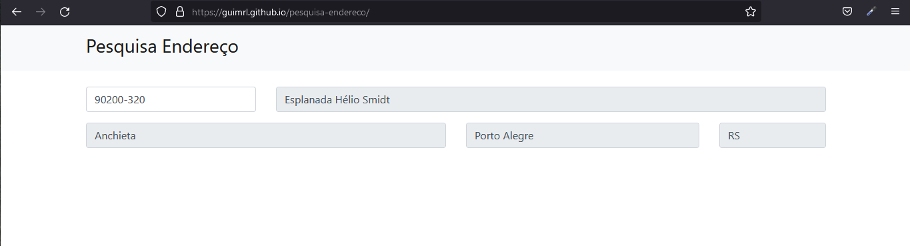

# Pesquisa Endereço

### Descrição

- Aplicação desenvolvida em html, javaScript, Ajax e bootstrap consumindo a API viacep
- Link da API: https://viacep.com.br/

### Como usar

- Basta digitar o CEP para descobrir a localização
Ex: 01001000, 90020-004

</img> 
